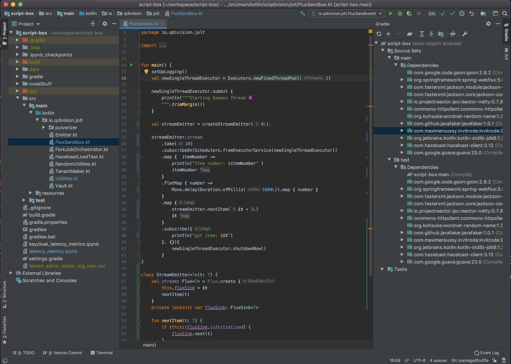
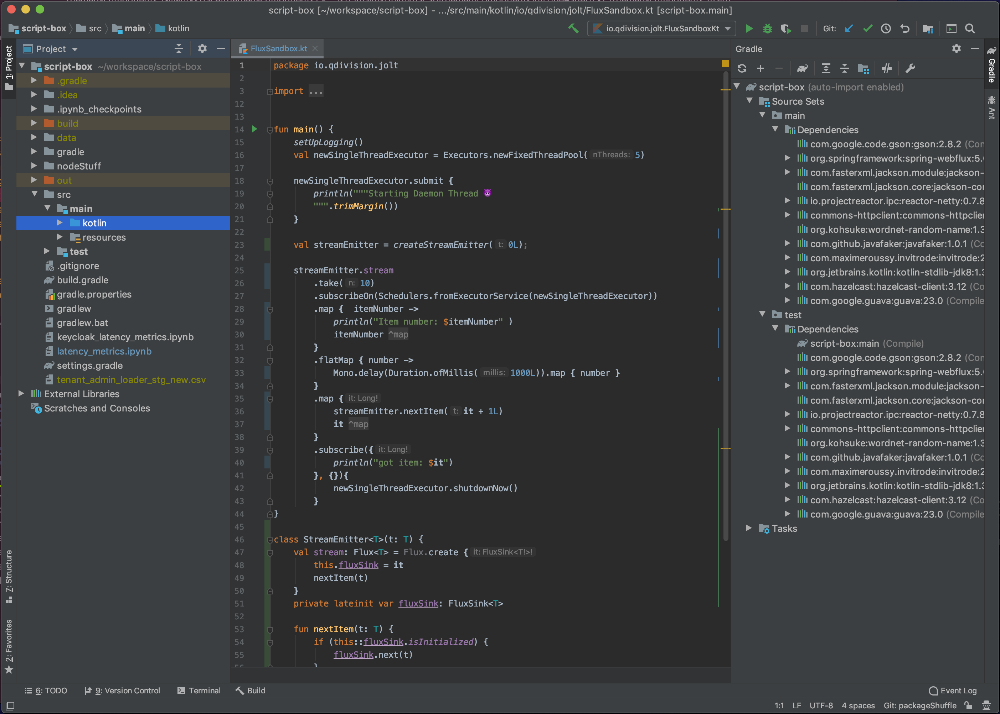

# Themed Components

---

A various collection of configurable UI components that give your JetBrains IDE that little extra something.

# Components

## Themed Title Bar
Works for any theme, custom or built in!
Colors the MacOS window title bar to the same color as the root window pane.

 |**Before** | **After** |
 | --- | --- |
 |  |  |

### [More themed title bar screens.](assets/screens/ThemedTitleScreens.md)

## Title Bar color Customization

Allows you to change the foreground colors of the Windows 10 and MacOS (themed) title bar

