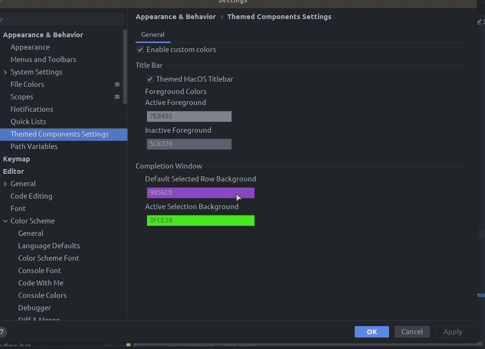

Themed Components
---

A various collection of configurable UI components that give your JetBrains IDE that little extra something.

## Installation

- Using IDE built-in plugin system:

  <kbd>Preferences</kbd> > <kbd>Plugins</kbd> > <kbd>Marketplace</kbd> > <kbd>Search for "Themed Components"</kbd> >
  <kbd>Install Plugin</kbd>

- Manually:

  Download the [latest release](https://github.com/Unthrottled/themed-components/releases/latest) and install it manually using
  <kbd>Preferences</kbd> > <kbd>Plugins</kbd> > <kbd>⚙️</kbd> > <kbd>Install plugin from disk...</kbd>

---

## Components

### Frameless Window
Works for any theme, custom or built in!
Colors the MacOS window title bar to the same color as the root window pane.
Giving it the frameless look and feel!

 |**Before** | **After** |
 | --- | --- |
 |  |  |

#### [More frameless windows](assets/screens/ThemedTitleScreens.md)

### Title Bar color Customization

Allows you to change the foreground colors of the Windows 10 and MacOS (themed) title bar

### Completion Window color customizations

**Default Selection Row Background** - this is normally the color of the first row in the completion popup window.

**Active Selection Row Background** - this is the color of the row in the completion popup window when you navigate each of the items in the window.

